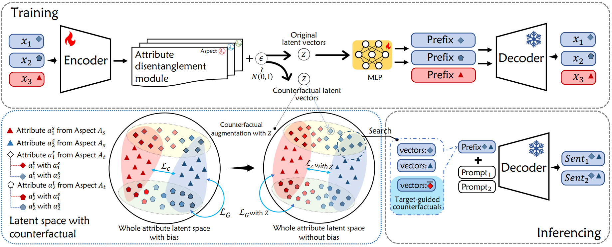

# MAGIC
Multi-Aspect Controllable Text Generation with Disentangled Counterfactual Augmentation, ACL 2024 (main)

This is the official repo for our paper `Multi-Aspect Controllable Text Generation with Disentangled Counterfactual Augmentation`

## Model Overview
<p align="center"></p>

An overview of MAGIC. **Top part**: We use the prefix tuning-based autoencoder structure as the
framework and construct the attribute latent space. **Bottom left**: The vectors with counterfactual attribute features generated by the attribute disentanglement module are assisted in the construction of the attribute latent space. **Bottom right** Inference stage with target-guided attribute correlation augmentation to improve multi-aspect control.

## Dataset
1. Download our training data from this [link](https://drive.google.com/drive/folders/17nIC_vuk9IyCHF_aDSvr0jcfYtQGMjxk?usp=drive_link). Unzip training data and put them under the `data` directory.

2. Download the discriminator checkpoints ([Discriminator](https://drive.google.com/drive/folders/1fHd256kLtMMmYXQSQ6X6mLHellZIGbMR?usp=drive_link), used to evaluate multi-aspect control. Unzip them and put them under the `model` folder.

## Quick Start

1. Training of MAGIC.
```bash
python train_multi.py 
--model_dir ./model \
--Ag_News_Path ./data/AG-data-7_3_sentiment.txt \
--IMDB_Path ./data/IMDb.txt \
--Toxic_Path ./data/Toxic.txt \
--batch_size 64 \
--epoch 300 \
--max_length 100 \
--sparse_loss 0.4 \
--latent_classify_loss 0.2 \
--aspect_gap_loss 0.3
```

2. Generation and Evaluation. Conduct conditional generation to obtain desired multi-apsect senteces. After generation, perform automatic evaluation to assess the quality of generated texts.
```bash
python probe.py 
--model_path ./model/CKPT_NAME \
--model_prefix add_flip \
--Agnews_path ./data/AG-data-7_3_sentiment.txt \
--output_dir ./generated_txt \
--log_res_root_path ./probe_eval_log \
--property default
```

## Reference
If you find the code helpful, please cite our paper:
```
@article{liu2024multi,
  title={Multi-Aspect Controllable Text Generation with Disentangled Counterfactual Augmentation},
  author={Liu, Yi and Liu, Xiangyu and Zhu, Xiangrong and Hu, Wei},
  journal={arXiv preprint arXiv:2405.19958},
  year={2024}
}
```
